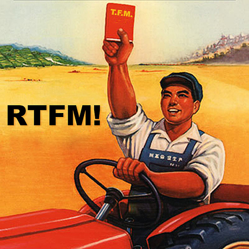
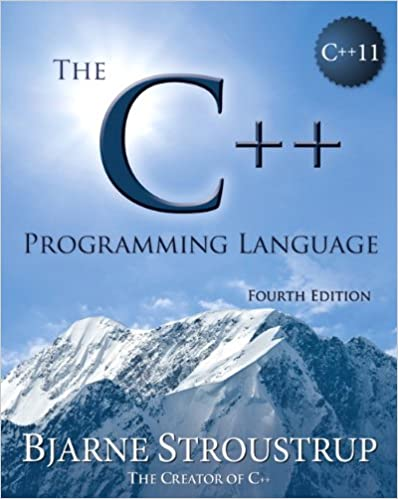
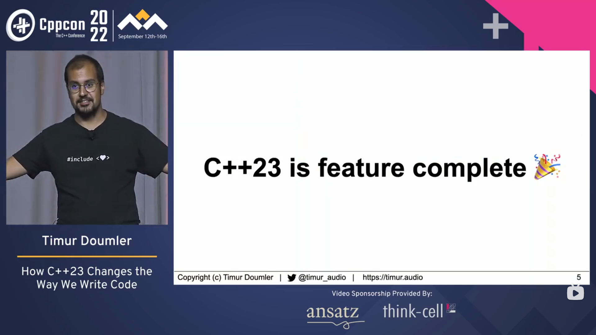
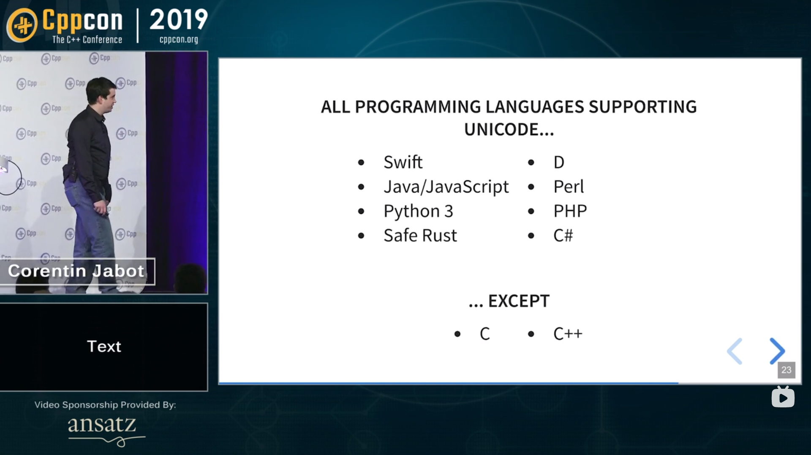
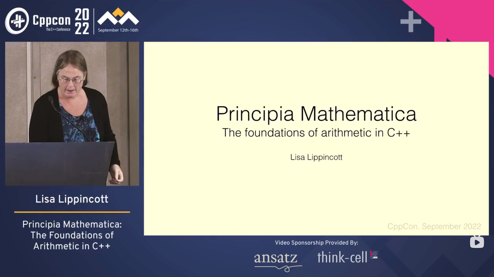

# CS100 Recitation 1

GKxx
 
---

## Contents

- C/C++ 语言标准
- 基本数据类型
- `main` 函数
- 初识运算符和表达式
- 说了 `Hello, world` 之后呢？

---

# C/C++ 语言标准

---

## C/C++ 的诞生

> 关于历史的部分我主要说 C++，因为比起 C 我更熟悉 C++。

- C 诞生于1972年的 Bell Laboratories，由 Dennis Ritchie 发明。
- 1979年，同样来自 Bell Lab 的 Bjarne Stroustrup 试图发明一种新的 C：
  - 它和 C 具有同等的抽象粒度，
  - 但吸收了一些好东西，尤其是来自 Simula 的“Class”和 strong static type checking。
- 1983年12月，“C with Classes” 正式更名为 “C++”。

---


---

## C++ 的诞生

彼时，C++ 的权威指南是1984年1月发布的第一份 C++ Manual。

1985年，Stroustrup 的著作《The C++ Programming Language》出版。

1990年：《The Annotated C++ Reference Manual》（*C++ ARM*）

1991年：《The C++ Programming Language》第二版。



---

## C++ 的诞生

与此同时，不断有新的特性加入 C++：

- 1990年7月：Templates
- 1990年11月：Exceptions
- 1993年3月：Run-time Type Identification (RTTI)
- 1993年7月：Namespaces
- 1994年：Standard Template Library (STL)

---

## 暂时尘埃落定：标准化

1998年，ISO/IEC 14882:1998 发布，即 C++ 的第一份 ISO 标准：**C++98**。

- C++ 正式拥有标准文档，而非借助著作、手册等作为参考。
- 标准化意味着不能随意变更，新特性要等下一个标准再加入。

---

## 标准化

1998年，ISO/IEC 14882:1998 发布，即 C++ 的第一份 ISO 标准：**C++98**。

- 2003年：“C++03”，是 C++98 的一份更正
- “C++0x”：新版本会在200x年到来？
- C++0x -> C++11，一份对于语言内核和标准库的大更新。
  - "C++11 feels like a new language."
  - "Modern C++"
- 自 C++11 起，每三年开一班列车：C++14, C++17, C++20, **C++23**, ...

---



---

## C 的标准化

- 第一份 C 语言标准：ISO/IEC 9899:1990 (C90)
  - ANSI X3.159-1989 (C89) 和 C90 是同一个语言。
- 1999年的 C99 加入了许多重要的东西，例如 `long long`，`bool`这样的类型。
  - 可惜 `long long` 没赶上 C++98，只能在 C++11 加入 C++ 标准，不过它早就被编译器支持了。
  - C++ 本来就有 `bool`。
- C 比 C++ 轻量很多，标准更新的频率也低一些。自 C11 起每 6 年一次：C11, C17, **C23**, ...

---

## 编译时设置语言标准

`gcc a.c -o a -std=c17`

`g++ a.cpp -o a -std=c++20`

- 试一试：`printf("%ld\n", __STDC_VERSION__)`
- C++：`std::cout << __cplusplus << std::endl;`

---

## 去哪看语言标准？

直接看标准文档：
- ISO 标准文档需要花钱购买
- open-std 有一些 working draft 可以免费下载，但是对初学者极不友好

一份友好的语言标准参考：[cppreference.com](cppreference.com)
- 以更友好、方便查找的方式对内容重新组织
- 大量地引用标准原文，保证内容的权威性
- 还包含 [compiler support](https://en.cppreference.com/w/cpp/compiler_support)、[experimental features](https://en.cppreference.com/w/cpp/experimental)、[常见第三方库](https://en.cppreference.com/w/cpp/links/libs) 等内容

---

# 基本数据类型

---

## 整数类型

- `short (int)`, `signed short (int)`, `unsigned short (int)`
- `int`, `signed (int)`, `unsigned (int)`
- `long (int)`, `signed long (int)`, `unsigned long (int)`
- `long long (int)`, `signed long long (int)`, `unsigned long long (int)`

---

## 整数类型

- `signed int` 和 `int` 是同一个类型吗？其它的呢？

---

## 整数类型

- `signed int` 和 `int` 是同一个类型吗？其它的呢？
  - 不带 `unsigned` 的都是带符号类型，`signed` 可以省略。
  - **例外：`char` 和 `signed char` 不是同一个类型，和 `unsigned char` 也不是。**

---

## 整数类型

- `signed int` 和 `int` 是同一个类型吗？其它的呢？
  - 不带 `unsigned` 的都是带符号类型，`signed` 可以省略。
  - **例外：`char` 和 `signed char` 不是同一个类型，和 `unsigned char` 也不是。**
- `int` 的大小（表示范围）是多少？`long` 呢？

---

## 整数类型

- `signed int` 和 `int` 是同一个类型吗？其它的呢？
  - 不带 `unsigned` 的都是带符号类型，`signed` 可以省略。
  - **例外：`char` 和 `signed char` 不是同一个类型，和 `unsigned char` 也不是。**
- `int` 的大小（表示范围）是多少？`long` 呢？
  - [**implementation-defined**](https://en.cppreference.com/w/c/language/behavior)!
  - `short` 和 `int` 至少 16 位；`long` 至少 32 位；`long long` 至少 64 位。
  - `1 == sizeof(char) <= sizeof(short) <= sizeof(int) <= sizeof(long) <= sizeof(long long)`
  - https://en.cppreference.com/w/c/language/arithmetic_types

---

## 整数类型

表示范围：以 32 位整数为例（假设 `int` 是 32 位）

- `int` 的范围是 $\left[-2^{31}, 2^{31}-1\right]$
- `unsigned int` 的范围是 $\left[0, 2^{32}-1\right]$
  - `int` 和 `unsigned int` 能表示的数一样多
  - `int` 最高位是符号位，因此最大只能到 $2^{31}-1$。

---

## 布尔类型

- `<stdbool.h>` 定义了 `bool` 类型 (since C99)。
- `bool` 类型的变量有两种值：`true`（真）和 `false`（假）。
  - 在有 `bool` 之前人们一般用 `int` 代替 `bool`，用非零值表示 `true`，零表示 `false`。
  - C 是如此地偏爱 `int`，以至于 C23 之前 `true` 和 `false` 居然被 `#define` 为 `1` 和 `0`。（RTFSC）
  - C 的逻辑运算符和关系运算符的返回值类型也是 `int`，而非 `bool`。
  - 其实也可以不用知道。
- 和其它整数类型之间的转换：非零值 $\Rightarrow$ `true`，零 $\Rightarrow$ `false`；`true` $\Rightarrow$ `1`，`false` $\Rightarrow$ `0`。

---

## 字符类型

- `char`, `signed char`, `unsigned char`
- 另外有一些宽字符/Unicode字符类型：`wchar_t`, `char16_t`, `char32_t`
- `char` 既不是 `signed char`，也不是 `unsigned char`！它们是三种不同的类型
  - `char` 可能被实现为带符号的或不带符号的，这是 **implementation-defined behavior**。
- 至于宽字符/Unicode... 情况有些复杂
  - "That's what Python people laugh at."
  - 我们建议暂时避开这个问题。

---

[](https://www.bilibili.com/video/BV1NE411h7hb?p=9&vd_source=7940495b5667750a71bfa10a4c6eb2d9)

---

## 究竟选哪个类型？

- 整数算术用 `int`。如果不够大，就用 `long long`。
- 该用布尔用 `bool`，尤其是在 C++ 中。
- 浮点数用 `double`。除非在特定场合中，否则 `float` 的精度经常不够用。
  - 不必担心 `double` 和 `float` 运算速度的差异。
  - `long double` 基本上用不到。

---

# `main` 函数

---

## 初识函数

一个函数：
- 接受一些**参数** (parameters)，
- 执行一些语句，称为**函数体** (function body)，
- 返回一个结果，称为**返回值** (return-value)。

例：数学函数 $f(x)=x^2,x\in\mathbb R$：

```c
double f(double x) {
  return x * x;
}
```

---

## 初识函数

例：数学函数 $f(x)=x^2,x\in\mathbb R$：

```c
double f(double x) {
  return x * x;
}
```

但函数体完全可以执行更复杂的操作：

```c
double f(double x) {
  printf("function 'f' is called with x = %lf\n", x);
  return x * x;
}
```

---

## `main` 函数

C 程序的 entrypoint，具有如下三种形式之一：

- ```c
  int main(void)
  ```
- ``` c
  int main(int argc, char **argv)
  ```
- Another implementation-defined signature.

对于第三种，一个典型的例子是许多操作系统支持的
```c
int main(int argc, char **argv, char **envp)
```
其中 `envp` 用来传递环境变量。

https://en.cppreference.com/w/c/language/main_function

---

## `main` 函数

目前我们只需了解 `int main(void)`。

- 这个函数不接受任何参数。
- `main` 函数应当返回 `int`。如果程序正常退出，返回 `0`；否则返回一个非零值。
- `return 0;` 语句无需显式地写出。若控制流到达函数体末尾而没有遇到一条 `return` 语句，则等价于 `return 0;`。

---

## `main` 函数

试一试：`void main() {}` 会发生什么？

> The definition `void main()` is not and never has been C++, nor has it even been C. - Bjarne Stroustrup

（我当年 CS100 期中考试的故事）

---

## `main` 函数

> The definition `void main()` is not and never has been C++, nor has it even been C. - Bjarne Stroustrup

`f(void)` 和 `f()`：

- C++ 和 C23 开始，都表示不接受参数。
- C23 之前 `f()` 表示接受任意多个任意类型的参数，`f(void)` 表示不接受参数。
- Stroustrup 发明 C-with-Classes 时引入了 `f(void)` 这个写法。
- `f(void)` 不够优雅，而 `f()` 接收参数不符合直觉。

---

## `main` 函数

你可能看过某些人省去返回值类型：

```c
main() {
  // ...
}
```

在 C99 以前，函数的返回值类型可以不显式地指出，这时这个返回值类型默认为 `int`。**但 C99 取消了这一规则**。

---

## 练习

定义函数 `f` 来计算 $f(x)=x^2,x\in\mathbb Z$；输入一个整数，调用 `f` 计算其平方并输出。

---

## 练习

定义函数 `f` 来计算 $f(x)=x^2,x\in\mathbb Z$；输入一个整数，调用 `f` 计算其平方并输出。

```c
#include <stdio.h>

int f(int x) {
  return x * x;
}

int main(void) {
  int n;
  scanf("%d", &n);
  printf("%d\n", f(n));
  return 0;
}
```

注意：**输入**$\neq$**传递参数**，**输出**$\neq$**返回**。

---

# 初识运算符和表达式

---

## 算术运算符

加减乘除模：`+`（一元正号、二元加号）, `-`（一元负号、二元减号）, `*`, `/`, `%`

位运算：`&`, `|`, `~`, `^`, `<<`, `>>`

算术表达式在求值时会经历一个非常难以描述的类型转换过程，包括**整型提升** (integral promotion) 和其它算术转换，例如带符号数与无符号数的转换、浮点数与整数的转换等。**最终，两侧运算对象会被转换成相同的类型，再进行算术求值。**

---



---

## 算术运算符

我们不是语言律师，所以只记住那些经常用到的情况就行。

- 如果两侧运算对象中至少有一个是浮点数，则另一个整数运算对象（如果有的话）将会被转换成那个浮点数类型，再进行运算。
- 对于 `/`：浮点数相除是浮点数，整数相除是整数。
  - C99/C++11 以前，整除的取整方向是 implementation-defined。
  - 自 C99/C++11 起，规定**向零取整**。
  - `3 / -2` 的结果是？
  - `a / 2` 和 `a / 2.0` 的区别？
  - `(a + 0.0) / b`, `1.0 * a / b`

---

## 算术运算符

- 取模 (modulo)：`a % b`
  - 如果 `a` 是负数，结果是正的还是负的？`b` 是负数呢？两个都是负数呢？

---

## 算术运算符

- 取模 (modulo)：`a % b`
  - ~~如果 `a` 是负数，结果是正的还是负的？`b` 是负数呢？两个都是负数呢？~~
  - 对任意整数（在不溢出的情况下）恒成立：
    ```c
    (a / b) * b + a % b == a
    ```

---

## 复合赋值运算符

`+=`, `-=`, `*=`, `/=`, `%=`, `<<=`, `>>=`, `&=`, `|=`, `^=`

- `a = a op b` 等价于 `a op= b`。
- **学会使用这样的运算符，让代码变得简洁、清晰**。
  - **简洁即美德**。

---

# 说了 `Hello, world` 之后呢？

---

## 说了 `Hello, world` 之后呢？

一个比 `Hello, world` 稍微复杂一丁点儿的是“A+B Problem”：

```c
#include <stdio.h>

int main(void) {
  int a, b;
  scanf("%d%d", &a, &b);
  printf("%d\n", a + b);
  return 0;
}
```

---

## A+B Problem

约定输入格式：两行，每行一个整数，分别表示 `a` 和 `b`。

- `scanf("%d\n%d\n", &a, &b)` 会发生什么？试一试。

---

## A+B Problem

约定输入格式：两行，每行一个整数，分别表示 `a` 和 `b`。

- `scanf("%d\n%d\n", &a, &b)` 会卡住，**直到你输入了一个非空白字符为止**。
- 看看标准：https://en.cppreference.com/w/c/io/fscanf
  
  > whitespace characters: any single whitespace character in the format string **consumes all available consecutive whitespace characters** from the input (determined as if by calling isspace in a loop). Note that **there is no difference** between `"\n"`, `" "`, `"\t\t"`, or other whitespace in the format string.
- whitespace character: “空白字符”，包括空格、换行、回车、制表等。

---

## A+B Problem

约定输入格式：两行，每行一个整数，分别表示 `a` 和 `b`。

- `scanf("%d%d", &a, &b)` 可以吗？试一试。

---

## A+B Problem

约定输入格式：两行，每行一个整数，分别表示 `a` 和 `b`。

- `scanf("%d%d", &a, &b)` 可以。
- 中间的换行符不写也可以？看看标准：
  
  > `"%d"` matches a decimal integer.

  > The format of the number is the same as expected by `strtol` with the value 10 for the base argument.
  
- `strtol` 是什么鬼？[点进去看看](https://en.cppreference.com/w/c/string/byte/strtol)：
  
  > Interprets an integer value in a byte string pointed to by str.

  > **Discards any whitespace characters** (as identified by calling `isspace`) until the first non-whitespace character is found, then...

---

## 说了 `Hello, world` 之后呢？

理论与实践结合：

- 理论：认准官方文档、手册。只需要高考英语及格的水平和亿点点耐心，你可以得到比任何教程、博客、题解、教材都要权威、准确的解答。
  - 英语水平越好，对耐心的要求越低。
- 实践：**计算机科学是一门实践科学**，需要大胆地尝试、实验。
  - `long` 的范围是多大？
  - 函数里能调用自身吗？
  - 如果 `f` 是一个无参函数，调用它的方式是 `f;` 还是 `f();`？
